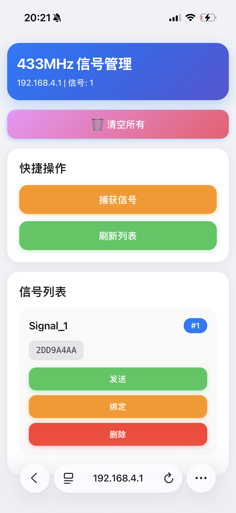
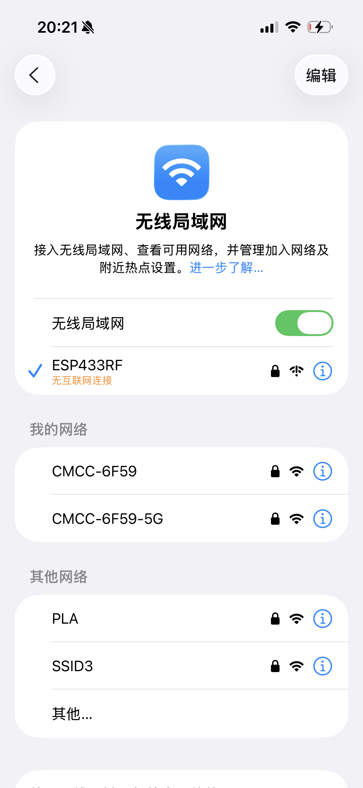

# ESP32-S3 433MHz 智能遥控器 📡

<p align="center">
  
  
</p>

> 🎓 **学习分享项目** - 基于立创ESP32-S3-R8N8开发板的433MHz射频信号管理系统  
> 支持手机WiFi连接控制，信号学习、存储、发送一键搞定！

---

## ⚠️ 重要声明

### 📋 使用前必读

**本项目仅供学习、研究和个人合法使用，请务必遵守以下规定：**

#### ✅ 允许的使用场景
- 学习ESP32和物联网开发技术
- 备份**自己的**遥控器信号（家用电器、车库门等）
- 控制**自己的**智能家居设备
- 教学演示和科研实验
- 个人DIY项目开发

#### ❌ 严禁的使用场景
- 复制**他人的**门禁卡或遥控器
- 未经授权访问他人的设备或系统
- 干扰合法的无线电通信
- 用于任何非法或未授权的目的
- 侵犯他人隐私或财产安全

#### ⚖️ 法律责任
- 使用者必须遵守所在国家/地区的法律法规和无线电管理规定
- 使用者对使用本项目造成的任何后果**自行承担全部法律责任**
- 作者不对任何滥用、误用或违法使用行为承担责任
- 如发现违法使用，请立即停止并向相关部门报告

#### 📡 技术规范
- 工作频率：433.92MHz（ISM免许可频段）
- 发射功率：≤10mW（符合国家无线电管理规定）
- 请勿擅自修改发射功率或工作频率

**⚠️ 继续使用本项目即表示您已阅读、理解并同意遵守以上所有条款**

---

## ✨ 项目特色

- 📱 **手机WiFi控制** - 无需电脑，手机连接WiFi即可管理
- 🎨 **iPhone风格界面** - 圆角设计，响应式布局，操作流畅
- 🔄 **多信号管理** - 支持存储最多50个信号，断电不丢失
- 🎯 **一键绑定** - 将常用信号绑定到Boot按钮，快速发送
- 🚫 **智能去重** - 自动识别重复信号，避免重复学习
- 💾 **Flash存储** - 所有信号保存在Flash中，关机后仍可使用

## 🎯 适用场景

- 🏠 智能家居遥控（电灯、风扇、空调等）
- 🚗 车库门遥控复制
- 🔔 门铃信号学习
- 📺 家电遥控备份
- 🎮 DIY遥控项目

## 🛠️ 硬件准备

### 推荐开发板
**立创ESP32-S3-R8N8开发板** 
- 购买链接：[立创商城](https://www.szlcsc.com/)
- 官方文档：https://wiki.lckfb.com/zh-hans/esp32s3r8n8/
- 特点：8MB PSRAM + 8MB Flash，性能强劲

> 💡 **其他ESP32开发板适配说明**  
> 本项目理论上支持所有ESP32/ESP32-S3开发板，只需根据您的开发板修改引脚定义即可。

### 必需模块

| 模块 | 型号推荐 | 连接引脚 | 说明 |
|------|---------|---------|------|
| 433MHz发射模块 | **远-T2L_433** | DATA→GPIO14 | 用于发送信号 |
| 433MHz接收模块 | **灵-R1A-M5_433** (串口版本) | DATA→GPIO18 | ⚠️ 必须选择M5串口版本 |
| LED指示灯 | 普通LED | 正极→GPIO21 | 状态指示（可选） |

> ⚠️ **重要提示**：
> - **接收模块**必须选择 **灵-R1A-M5_433/315 串口版本**，不要选择普通版本！串口版本才能输出数字信号。
> - **发射模块**推荐使用 **远-T2L_433**，发射距离更远，性能更稳定。

### 接线图

```
ESP32-S3-R8N8 开发板
├── GPIO14 ──→ 发射模块 DATA (远-T2L_433)
├── GPIO18 ──→ 接收模块 DATA (灵-R1A-M5_433 串口版本)
├── GPIO21 ──→ LED 正极（可选）
├── GPIO0  ──→ Boot按键（板载）
├── 5V     ──→ 模块 VCC
└── GND    ──→ 模块 GND
```

## 🚀 快速开始

### 方式一：使用PlatformIO（推荐新手）

#### 1. 安装开发环境

1. 下载并安装 [VS Code](https://code.visualstudio.com/)
2. 在VS Code中安装 **PlatformIO IDE** 插件
3. 重启VS Code

#### 2. 克隆项目

```bash
git clone https://github.com/zhoushoujianwork/433_test_arduino.git
cd 433_test_arduino
```

#### 3. 打开项目

在VS Code中：`文件` → `打开文件夹` → 选择 `433_test_arduino` 文件夹

#### 4. 编译上传

1. 连接ESP32开发板到电脑（USB线）
2. 点击底部状态栏的 **✓ (Build)** 按钮编译
3. 点击底部状态栏的 **→ (Upload)** 按钮上传
4. 点击底部状态栏的 **🔌 (Monitor)** 按钮查看串口输出

### 方式二：使用Arduino IDE

#### 1. 安装Arduino IDE

下载并安装 [Arduino IDE 2.x](https://www.arduino.cc/en/software)

#### 2. 安装ESP32支持

1. 打开Arduino IDE
2. `文件` → `首选项` → `附加开发板管理器网址` 中添加：
   ```
   https://espressif.github.io/arduino-esp32/package_esp32_index.json
   ```
3. `工具` → `开发板` → `开发板管理器` → 搜索 "ESP32" → 安装

#### 3. 安装依赖库

在Arduino IDE中：`工具` → `管理库` → 搜索并安装：
- `rc-switch` (by sui77)

#### 4. 上传代码

1. 选择开发板：`工具` → `开发板` → `ESP32 Arduino` → `ESP32S3 Dev Module`
2. 选择端口：`工具` → `端口` → 选择对应的COM口
3. 点击 **上传** 按钮

## 📱 使用教程

### 第一步：连接WiFi

1. **ESP32上电后会自动创建WiFi热点**
   - WiFi名称：`ESP433RF`
   - WiFi密码：`12345678`

2. **使用手机连接WiFi**
   - 打开手机WiFi设置
   - 找到并连接 `ESP433RF`
   - 输入密码 `12345678`

<p align="center">
  
</p>

### 第二步：打开管理页面

1. **打开浏览器访问**
   - 地址：`http://192.168.4.1`
   - 或查看串口输出中的IP地址

2. **管理页面功能**

<p align="center">
  
</p>

### 第三步：学习信号

1. 点击 **"捕获信号"** 按钮（橙色）
2. 按下你要学习的遥控器按键
3. 信号自动保存，显示在列表最上方
4. 重复以上步骤可学习多个信号

### 第四步：使用信号

#### 方式1：网页发送
- 点击信号旁边的 **"发送"** 按钮（绿色）

#### 方式2：绑定Boot按钮
1. 点击信号旁边的 **"绑定"** 按钮（橙色）
2. 该信号会显示 **"🎯 Boot绑定"** 标签
3. 短按开发板上的Boot按钮即可发送

#### 方式3：删除信号
- 点击信号旁边的 **"删除"** 按钮（红色）

#### 方式4：清空所有
- 点击页面顶部的 **"🗑️ 清空所有"** 按钮

## 🎮 Boot按钮功能

| 操作 | 功能 | 说明 |
|------|------|------|
| **短按** | 发送绑定的信号 | 快速发送常用信号 |
| **长按2秒** | 清空复刻信号 | 清空旧的学习模式信号 |

## 💡 LED状态指示

| LED状态 | 含义 | 说明 |
|---------|------|------|
| **熄灭** | 待机状态 | 系统正常运行 |
| **快闪** | 捕获模式 | 等待接收信号 |
| **常亮** | 已捕获信号 | 信号学习成功 |

## 🔧 进阶配置

### 修改WiFi名称和密码

编辑 `src/main.cpp` 文件，找到以下代码并修改：

```cpp
// 在 setup() 函数中
webManager.begin("ESP433RF", "12345678");  // 修改这里
//               ↑WiFi名称   ↑WiFi密码
```

### 修改引脚定义

如果使用其他ESP32开发板，需要修改引脚定义：

```cpp
// 在 main.cpp 顶部
#define TX_PIN 14      // 发射模块引脚
#define RX_PIN 18      // 接收模块引脚
#define LED_PIN 21     // LED引脚
#define REPLAY_BUTTON_PIN 0  // Boot按钮引脚
```

### 修改信号存储数量

编辑 `src/main.cpp`，修改以下代码：

```cpp
SignalManager signalManager(50);  // 括号内的数字即为最大存储数量
```

## 📂 项目结构

```
433_test_arduino/
├── src/
│   └── main.cpp                    # 主程序
├── lib/
│   ├── ESP433RF/                   # 433MHz收发核心库
│   │   ├── ESP433RF.h
│   │   └── ESP433RF.cpp
│   ├── SignalManager/              # 信号管理库
│   │   ├── SignalManager.h
│   │   └── SignalManager.cpp
│   └── ESP433RFWeb/                # Web管理界面库
│       ├── ESP433RFWeb.h
│       └── ESP433RFWeb.cpp
├── docs/                           # 文档和图片
│   ├── 管理页面.PNG
│   ├── wifi界面.PNG
│   └── ...
├── platformio.ini                  # PlatformIO配置
└── README.md                       # 本文件
```

## 🔍 技术细节

### 核心技术栈
- **平台**: ESP32-S3 (Arduino Framework)
- **无线**: WiFi AP模式
- **Web服务器**: ESP32 WebServer
- **433MHz协议**: EV1527/PT2262 (24位编码)
- **存储**: ESP32 Preferences (NVS Flash)

### 信号格式说明
- **地址码**: 6位十六进制 (24位二进制)
- **按键值**: 2位十六进制 (8位二进制)
- **完整信号**: 8位十六进制 (如: `2DD9A4AA`)
- **实际发送**: 前24位 (地址码)

### 库依赖
- `rc-switch@^2.6.4` - 433MHz信号发送
- `ESP32 Preferences` - Flash存储
- `ESP32 WiFi` - WiFi AP模式
- `ESP32 WebServer` - Web服务器

## ❓ 常见问题

### Q1: 手机连不上WiFi？
**A:** 
1. 确认ESP32已上电且程序正常运行
2. 查看串口输出，确认WiFi已启动
3. 有些手机会提示"此网络无互联网连接"，点击"仍然连接"即可
4. 尝试关闭手机的移动数据

### Q2: 打不开管理页面？
**A:**
1. 确认已连接到ESP32的WiFi
2. 尝试访问 `http://192.168.4.1`
3. 查看串口输出中显示的IP地址
4. 清除浏览器缓存后重试

### Q3: 学习不到信号？
**A:**
1. 确认接收模块连接正确
2. 遥控器距离接收模块不要太远（建议10-30cm）
3. 查看串口输出是否有接收日志
4. 确认遥控器是433MHz频率

### Q4: 发送信号无效？
**A:**
1. 确认发射模块连接正确
2. 检查发射模块供电是否正常（建议5V供电）
3. 发射距离不要太远（建议1-5米测试）
4. 查看串口输出确认是否发送成功

### Q5: 信号重复添加？
**A:** 
系统已自动去重，相同信号不会重复添加。如果出现重复，可能是：
1. 遥控器每次按键发送的信号略有不同
2. 接收模块接收到了多次信号

### Q6: 其他开发板如何适配？
**A:**
1. 确认您的开发板是ESP32或ESP32-S3系列
2. 修改 `platformio.ini` 中的 `board` 配置
3. 根据您的开发板原理图修改引脚定义
4. 如有问题，参考立创开发板文档：https://wiki.lckfb.com/

## 🎓 学习资源

### 立创ESP32-S3开发板
- 官方Wiki: https://wiki.lckfb.com/zh-hans/esp32s3r8n8/
- 购买链接: [立创商城](https://www.szlcsc.com/)
- 社区论坛: [立创社区](https://oshwhub.com/)

### ESP32学习资料
- [ESP32官方文档](https://docs.espressif.com/projects/esp-idf/zh_CN/latest/esp32s3/)
- [Arduino ESP32教程](https://docs.arduino.cc/learn/starting-guide/getting-started-arduino)
- [立创开发板教程](https://wiki.lckfb.com/)

### 433MHz相关
- [RCSwitch库文档](https://github.com/sui77/rc-switch)
- [433MHz协议解析](https://www.princetronics.com/how-to-read-433-mhz-codes-w-arduino-433-mhz-receiver/)

## 📄 开源协议

本项目采用 **MIT License** 开源协议

```
MIT License

Copyright (c) 2025 Zhoushoujian

Permission is hereby granted, free of charge, to any person obtaining a copy
of this software and associated documentation files (the "Software"), to deal
in the Software without restriction, including without limitation the rights
to use, copy, modify, merge, publish, distribute, sublicense, and/or sell
copies of the Software, and to permit persons to whom the Software is
furnished to do so, subject to the following conditions:

The above copyright notice and this permission notice shall be included in all
copies or substantial portions of the Software.

THE SOFTWARE IS PROVIDED "AS IS", WITHOUT WARRANTY OF ANY KIND, EXPRESS OR
IMPLIED, INCLUDING BUT NOT LIMITED TO THE WARRANTIES OF MERCHANTABILITY,
FITNESS FOR A PARTICULAR PURPOSE AND NONINFRINGEMENT. IN NO EVENT SHALL THE
AUTHORS OR COPYRIGHT HOLDERS BE LIABLE FOR ANY CLAIM, DAMAGES OR OTHER
LIABILITY, WHETHER IN AN ACTION OF CONTRACT, TORT OR OTHERWISE, ARISING FROM,
OUT OF OR IN CONNECTION WITH THE SOFTWARE OR THE USE OR OTHER DEALINGS IN THE
SOFTWARE.
```

**⚠️ 使用声明**
- ✅ 本项目仅供学习和研究使用
- ✅ 请遵守当地法律法规，不得用于非法用途
- ✅ 不得用于破解他人遥控器或进行未授权访问
- ✅ 使用本项目造成的任何后果由使用者自行承担

## 👨‍💻 作者

**Zhoushoujian**
- GitHub: [@zhoushoujianwork](https://github.com/zhoushoujianwork)
- Email: zhoushoujianwork@163.com

## 🙏 致谢

- [立创开发板](https://wiki.lckfb.com/) - 提供优质的ESP32开发板
- [RCSwitch](https://github.com/sui77/rc-switch) - 433MHz信号发送库
- [ESP32 Arduino](https://github.com/espressif/arduino-esp32) - ESP32 Arduino框架

## 📝 更新日志

### v2.0.0 (2025-11-08)
- ✨ 新增WiFi AP模式和Web管理界面
- ✨ 新增多信号管理功能（最多50个）
- ✨ 新增信号去重功能
- ✨ 新增Boot按钮绑定功能
- ✨ iPhone风格UI设计
- ✨ 支持手机端控制
- 🔧 优化学习模式，一次只学习一个信号
- 🔧 发送时自动禁用接收，避免自干扰
- 🗑️ 移除串口命令交互，简化使用

### v1.0.0 (2025-11-07)
- 🎉 初始版本
- ✅ 实现433MHz信号收发
- ✅ 实现信号复刻功能
- ✅ 实现LED状态指示
- ✅ 实现Boot按钮控制
- ✅ 实现Flash持久化存储

## 💬 问题反馈

如果您在使用过程中遇到问题，欢迎：
1. 提交 [GitHub Issue](https://github.com/zhoushoujianwork/433_test_arduino/issues)
2. 参考上面的"常见问题"章节
3. 查看串口输出日志进行调试

## ⭐ 支持项目

如果这个项目对您有帮助，欢迎：
- ⭐ Star 本项目
- 🔀 Fork 并改进
- 📢 分享给更多人
- 💬 提出建议和反馈

---

<p align="center">
  Made with ❤️ by Zhoushoujian<br>
  仅供学习交流使用 | For Learning and Sharing Only
</p>
