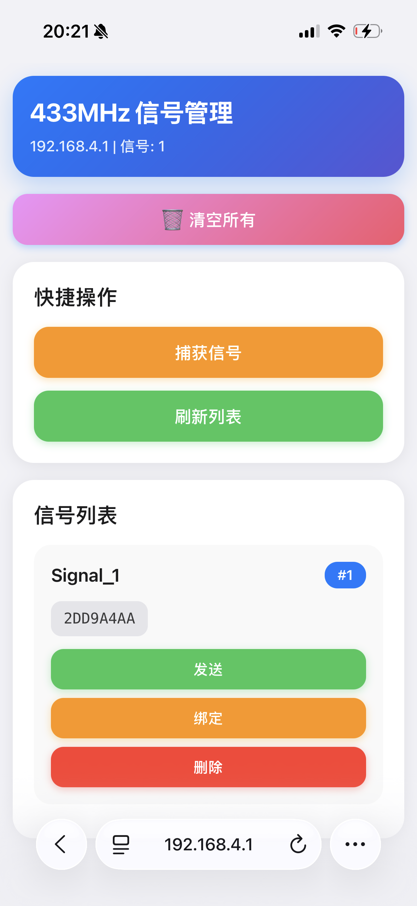
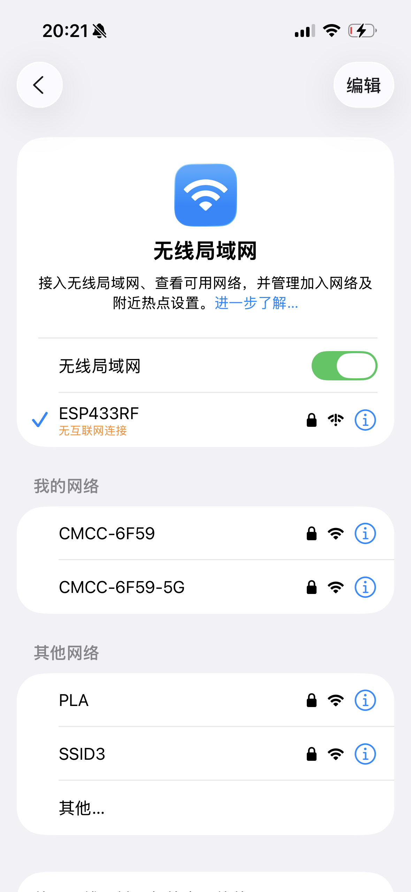

# ESP32-S3 433MHz 智能遥控器

<p align="center">
  
  
</p>

<p align="center">
  <a href="https://www.bilibili.com/video/BV12R19B5EsX/">📺 B站视频演示</a> •
  <a href="QUICK_START.md">🚀 快速入门</a> •
  <a href="HARDWARE_KIT.md">🛒 硬件套件</a>
</p>

> 基于 ESP32-S3 的 433MHz 射频信号管理系统，支持手机 WiFi 控制，信号学习、存储、发送一键搞定

---

## ⚠️ 使用声明

**本项目仅供学习、研究和个人合法使用**

- ✅ 允许：学习物联网开发、备份自己的遥控器、控制自己的智能家居设备
- ❌ 禁止：复制他人门禁卡、未经授权访问他人设备、干扰合法无线电通信
- ⚖️ 使用者对使用本项目造成的任何后果自行承担全部法律责任

**继续使用即表示您已阅读并同意遵守以上条款**

---

## ✨ 核心特性

- 📱 **手机 WiFi 控制** - 无需电脑，手机浏览器即可管理
- 🎨 **现代化界面** - iPhone 风格设计，响应式布局
- 🔄 **多信号管理** - 支持存储 50 个信号，断电不丢失
- 🎯 **一键绑定** - 将常用信号绑定到 Boot 按钮
- 🚫 **智能去重** - 自动识别重复信号
- 💾 **Flash 存储** - 所有数据保存在 Flash 中

## 🎯 适用场景

智能家居遥控、车库门复制、门铃学习、家电遥控备份、DIY 遥控项目

## 🛠️ 硬件准备

### 推荐配置

| 组件 | 型号 | 连接引脚 | 说明 |
|------|------|---------|------|
| 开发板 | 立创 ESP32-S3-R8N8 | - | 8MB PSRAM + 8MB Flash |
| 发射模块 | 远-T2L_433 | GPIO14 | 433MHz 发射 |
| 接收模块 | 灵-R1A-M5_433 (串口版) | GPIO18 | ⚠️ 必须选串口版本 |
| LED 指示灯 | 普通 LED | GPIO21 | 状态指示（可选）|

> 💡 **完整硬件套件清单**请查看 [HARDWARE_KIT.md](HARDWARE_KIT.md)

### 接线图

```
ESP32-S3-R8N8
├── GPIO14 → 发射模块 DATA
├── GPIO18 → 接收模块 DATA
├── GPIO21 → LED 正极（可选）
├── 5V     → 模块 VCC
└── GND    → 模块 GND
```

## 🚀 快速开始

### 方式一：Web 在线烧录（推荐，无需开发环境）

**适合没有开发环境的用户，只需浏览器即可烧录固件**

1. 下载最新固件：访问 [Releases](https://github.com/zhoushoujianwork/433_test_arduino/releases) 下载 `firmware-package.zip`
2. 解压后**双击打开** `flasher-standalone.html` 文件（无需启动服务器）
3. 点击"选择 firmware.bin 文件"按钮，选择解压出的 `firmware.bin`
4. 使用 USB 数据线连接 ESP32-S3 到电脑
5. 点击"连接并烧录固件"按钮，选择对应的串口设备
6. 等待烧录完成（约 1-2 分钟）

> 💡 **浏览器要求**：Chrome 89+ 或 Edge 89+（不支持 Firefox 和 Safari）  
> 💡 **无需安装**：直接双击 HTML 文件即可，无需启动服务器或安装任何软件

### 方式二：PlatformIO

```bash
# 1. 克隆项目
git clone https://github.com/zhoushoujianwork/433_test_arduino.git
cd 433_test_arduino

# 2. 用 VS Code 打开项目（需安装 PlatformIO 插件）

# 3. 编译上传
# 点击底部状态栏：✓ (Build) → → (Upload) → 🔌 (Monitor)
```

### 方式三：Arduino IDE

1. 安装 [Arduino IDE 2.x](https://www.arduino.cc/en/software)
2. 添加 ESP32 支持：`首选项` → `附加开发板管理器网址` 添加
   ```
   https://espressif.github.io/arduino-esp32/package_esp32_index.json
   ```
3. 安装依赖库：`工具` → `管理库` → 搜索安装 `rc-switch`
4. 选择开发板：`ESP32S3 Dev Module`
5. 上传代码

> 📖 **详细步骤**请查看 [QUICK_START.md](QUICK_START.md)

## 📱 使用教程

### 1. 连接 WiFi

ESP32 上电后自动创建热点：
- WiFi 名称：`ESP433RF`
- WiFi 密码：`12345678`

> 💡 **自动跳转**：连接成功后，手机会自动弹出管理页面（Captive Portal）

### 2. 打开管理页面

如果没有自动弹出，手动访问：`http://192.168.4.1`

### 3. 学习信号

1. 点击 **"捕获信号"** 按钮
2. 按下遥控器按键
3. 信号自动保存到列表

### 4. 使用信号

- **网页发送**：点击信号旁的 "发送" 按钮
- **Boot 按钮**：绑定信号后，短按 Boot 按钮即可发送
- **删除信号**：点击 "删除" 按钮

## 🎮 Boot 按钮功能

| 操作 | 功能 |
|------|------|
| 短按 | 发送绑定的信号 |
| 长按 2 秒 | 清空复刻信号 |

## 💡 LED 状态指示

| LED 状态 | 含义 |
|---------|------|
| 熄灭 | 待机状态 |
| 快闪 | 捕获模式 |
| 常亮 | 已捕获信号 |

## 🔧 进阶配置

### 修改 WiFi 名称和密码

编辑 `src/main.cpp`：

```cpp
webManager.begin("ESP433RF", "12345678");  // 修改这里
```

### 修改引脚定义

```cpp
#define TX_PIN 14      // 发射模块引脚
#define RX_PIN 18      // 接收模块引脚
#define LED_PIN 21     // LED 引脚
```

### 修改信号存储数量

```cpp
SignalManager signalManager(50);  // 最大存储数量
```

## 📂 项目结构

```
433_test_arduino/
├── src/
│   └── main.cpp                    # 主程序
├── lib/
│   ├── ESP433RF/                   # 433MHz 收发核心库
│   ├── SignalManager/              # 信号管理库
│   └── ESP433RFWeb/                # Web 管理界面库
├── docs/                           # 文档和图片
├── platformio.ini                  # PlatformIO 配置
├── readme.md                       # 本文件
├── QUICK_START.md                  # 快速入门指南
└── HARDWARE_KIT.md                 # 硬件套件清单
```

## 🔍 技术细节

- **平台**: ESP32-S3 (Arduino Framework)
- **无线**: WiFi AP 模式
- **Web 服务器**: ESP32 WebServer
- **433MHz 协议**: EV1527/PT2262 (24 位编码)
- **存储**: ESP32 Preferences (NVS Flash)
- **库依赖**: rc-switch@^2.6.4

## ❓ 常见问题

<details>
<summary><b>Q1: 手机连不上 WiFi？</b></summary>

1. 确认 ESP32 已上电且程序正常运行
2. 查看串口输出，确认 WiFi 已启动
3. 手机提示"无互联网连接"时，点击"仍然连接"
4. 尝试关闭手机的移动数据
</details>

<details>
<summary><b>Q2: 打不开管理页面？</b></summary>

1. 确认已连接到 ESP32 的 WiFi
2. 尝试访问 `http://192.168.4.1`
3. 查看串口输出中显示的 IP 地址
4. 清除浏览器缓存后重试
</details>

<details>
<summary><b>Q3: 学习不到信号？</b></summary>

1. 确认接收模块连接正确
2. 遥控器距离接收模块 10-30cm
3. 查看串口输出是否有接收日志
4. 确认遥控器是 433MHz 频率
</details>

<details>
<summary><b>Q4: 发送信号无效？</b></summary>

1. 确认发射模块连接正确
2. 检查发射模块供电是否正常（建议 5V）
3. 发射距离不要太远（建议 1-5 米测试）
4. 查看串口输出确认是否发送成功
</details>

<details>
<summary><b>Q5: 其他开发板如何适配？</b></summary>

1. 确认是 ESP32 或 ESP32-S3 系列
2. 修改 `platformio.ini` 中的 `board` 配置
3. 根据开发板原理图修改引脚定义
4. 参考立创开发板文档：https://wiki.lckfb.com/
</details>

## 🎓 学习资源

- [立创 ESP32-S3 官方 Wiki](https://wiki.lckfb.com/zh-hans/esp32s3r8n8/)
- [ESP32 官方文档](https://docs.espressif.com/projects/esp-idf/zh_CN/latest/esp32s3/)
- [RCSwitch 库文档](https://github.com/sui77/rc-switch)
- [Arduino ESP32 教程](https://docs.arduino.cc/learn/starting-guide/getting-started-arduino)

## 📄 开源协议

本项目采用 **MIT License** 开源协议

```
MIT License - Copyright (c) 2025 Zhoushoujian
```

## 👨‍💻 作者

**Zhoushoujian**
- GitHub: [@zhoushoujianwork](https://github.com/zhoushoujianwork)
- Email: zhoushoujianwork@163.com

## 🙏 致谢

- [立创开发板](https://wiki.lckfb.com/) - 提供优质的 ESP32 开发板
- [RCSwitch](https://github.com/sui77/rc-switch) - 433MHz 信号发送库
- [ESP32 Arduino](https://github.com/espressif/arduino-esp32) - ESP32 Arduino 框架

## 📝 更新日志

### v2.0.0 (2025-11-08)
- ✨ 新增 WiFi AP 模式和 Web 管理界面
- ✨ 新增多信号管理功能（最多 50 个）
- ✨ 新增信号去重功能
- ✨ 新增 Boot 按钮绑定功能
- ✨ iPhone 风格 UI 设计
- 🔧 优化学习模式
- 🗑️ 移除串口命令交互

### v1.0.0 (2025-11-07)
- 🎉 初始版本
- ✅ 实现 433MHz 信号收发
- ✅ 实现信号复刻功能
- ✅ 实现 Flash 持久化存储

## 💬 问题反馈

如果您在使用过程中遇到问题，欢迎：
- 提交 [GitHub Issue](https://github.com/zhoushoujianwork/433_test_arduino/issues)
- 参考上面的"常见问题"章节

## ⭐ 支持项目

如果这个项目对您有帮助，欢迎：
- ⭐ Star 本项目
- 🔀 Fork 并改进
- 📢 分享给更多人

## 🛒 硬件套件

**我们提供完整的硬件套件（开发板 + 模块 + 配件），开箱即用！**

需要购买套件的朋友，请在 [Issue](https://github.com/zhoushoujianwork/433_test_arduino/issues) 中评论联系，看到后会及时回复。

详细套件清单请查看：[HARDWARE_KIT.md](HARDWARE_KIT.md)

---

<p align="center">
  Made with ❤️ by Zhoushoujian<br>
  仅供学习交流使用 | For Learning and Sharing Only
</p>
